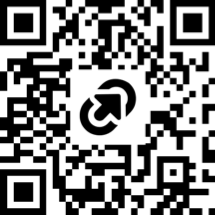

# Teach the Word...

## Commentary
- [How to discern the Truth](2026-Q2/Devotionals/HowToDiscernTheTruth.pdf)
- [How to discern the Sacred](2026-Q2/Devotionals/HowToDiscernTheSacred.pdf)
- [Living between two Righteousness's](2026-Q2/Devotionals/LivingBetweenTwoRighteousness.pdf)
- [God's Created Order](2026-Q1/Commentary/GodsCreatedOrder.pdf)
- [How to Know God](2026-Q1/Commentary/HowToKnowGod.pdf)
- [Biblical Reconciliation](2026-Q1/Commentary/BiblicalReconciliation.pdf)

## Recommended Topics
- [God of Promises](2026-Q4/) - God's character, the basis for both promise and covenant.
- [God of Righteousness](2026-Q1) - God's righteousness versus mankind's attempts at morality.
- [The Gospel](2026-Q2) - Paul the Apostle's seminal message to the church in Rome.
- [Church Unity](2025-Q3) - A call to Reconciliation and the Obedience of Faith.
- [Teaching Authority](2026-Q1/Resources/OversightTeaching.pdf) - May Elders delegate teaching authority?
- [1 Timothy 2:9-15](2026-Q1/Resources/1Timothy2-Exegesis.pdf) - On the debate of this generation.
- [1 Enoch Synopsis](2026-Q1/Resources/Synopsis1stEnoch.pdf) - A summary of the first Enoch narrative.

----------------------------------------------------------------------------------------------------------------

  

